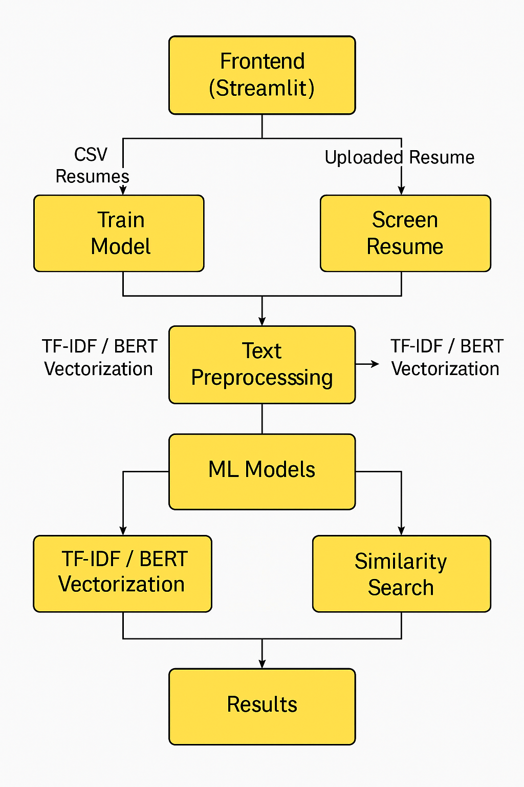

# 🤖 AI Resume Screener

This project uses machine learning (TF-IDF and BERT-based models) to classify resumes into job categories such as Data Science, Web Development, DevOps, etc. It also extracts top skills and predicts job fit with confidence levels.

---

## 📌 Features

- Upload resumes in `.pdf`, `.docx`, or `.txt` format
- Train models on custom or sample data
- Choose between feature extraction methods: TF-IDF or BERT
- Select ML models: Logistic Regression, Random Forest, or Naive Bayes
- Evaluate performance using Accuracy, Confusion Matrix, and Classification Report
- Predict job category and confidence for uploaded resumes
- Visualize performance metrics directly in Streamlit

---

## 🚀 How to Run

### 1. Clone this repository

git clone https://github.com/ge-studi/AI-Resume-Screener
cd AI-Resume-Screener

2. Install dependencies

pip install -r requirements.txt
Make sure to install NLTK and download stopwords:

import nltk
nltk.download('punkt')
nltk.download('stopwords')

3. Start Streamlit
streamlit run resume_screener.py
🧠 Models Supported
Feature Type	Model	Accuracy (Sample Data)
TF-IDF	Logistic Regression	99.48%
TF-IDF	Random Forest	99.48%
TF-IDF	Naive Bayes	96.89%
BERT	Logistic Regression	66.67%
BERT	Random Forest	99.48%

🖼 Architecture

📂 Folder Structure

resume-screener/
<<<<<<< HEAD
│
├── resume_screener.py        # Main Streamlit app
├── requirements.txt          # Python dependencies
├── README.md                 # Project documentation
├── architecture.png          # Architecture diagram
└── resume_model.pkl          # Saved model after training (auto-generated)

🔖 Sample Job Categories
Data Science
=======

├── resume_screener.py # Main Streamlit app

├── requirements.txt # Project dependencies

├── resume_model.pkl # Trained ML model (generated after training)

├── sample_resumes.csv # Optional: sample resume training data

└── README.md # Descriptive file about the project

## 📦 Installation
git clone 
https://github.com/your-username/resume-screener.git

cd resume-screener

pip install -r requirements.txt

streamlit run resume_screener.py
>>>>>>> dcd6e8cffc398f640a0e15ee533da71c2c0c8d83

Software Development

Web Development

DevOps

Digital Marketing

HR

Finance

Sales

Business Analyst

Project Management

<<<<<<< HEAD
📃 License
This project is licensed under the MIT License.
=======
JD (Job Description) upload and candidate ranking system

Candidate shortlisting with customizable filters

📩 Contact
For suggestions, improvements, or demo requests:
📧 gssingh6393@gmail.com

🔗 https://www.linkedin.com/in/geetanjali--singh/

📝 License
MIT License
>>>>>>> dcd6e8cffc398f640a0e15ee533da71c2c0c8d83

🧑‍💻 Author
Developed with ❤️ by Geetanjali 
Feel free to fork, contribute, or raise issues.

