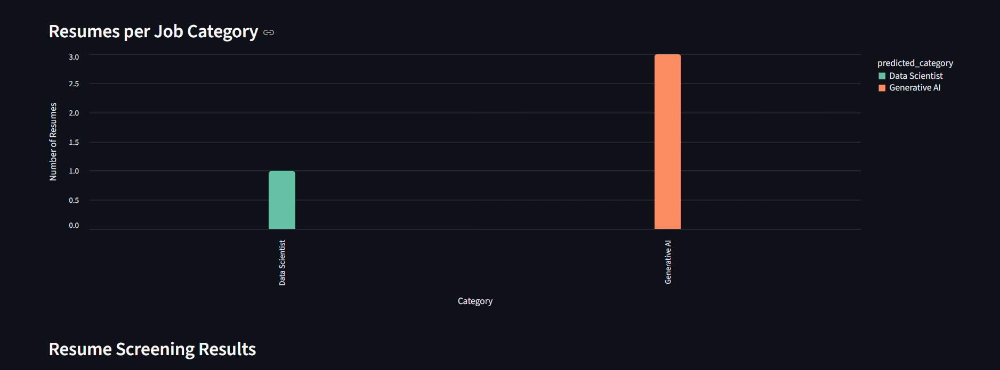
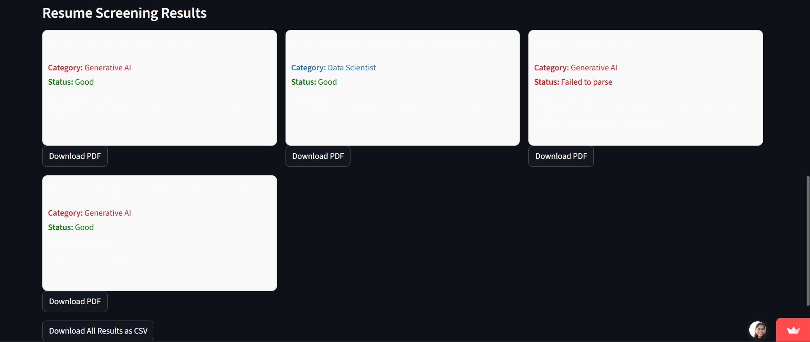

# AI-Powered Resume Screening & Candidate Ranking System

🔗 Live Demo: https://ai-resume-screener-pt4gpcl5mwxi54ambclbve.streamlit.app/

---

## 📌 Problem Statement
Recruiters often need to manually screen hundreds of resumes for a single job opening.  
This process is time-consuming, prone to bias, and delays hiring decisions.

---

## 💡 Solution
This project automates the resume screening process by using **Natural Language Processing (NLP)** to analyze resumes and rank candidates based on their similarity to a given job description.

The system helps recruiters quickly identify the most relevant candidates, significantly reducing manual effort.

---

## 🚀 Key Features
- Upload and analyze multiple resumes
- Input custom job descriptions
- NLP-based resume text extraction and preprocessing
- Candidate ranking using similarity scores
- Interactive and user-friendly Streamlit interface
- Real-time resume screening results

---

## 🛠 Tech Stack
- **Python**
- **NLP:** TF-IDF, Cosine Similarity
- **Libraries:** Pandas, NumPy, Scikit-learn
- **Frontend & Deployment:** Streamlit

---

## 🧠 Approach
1. Extract text from uploaded resumes (PDF/Text)
2. Clean and preprocess resume and job description text
3. Convert text into TF-IDF vectors
4. Calculate cosine similarity between resumes and job description
5. Rank candidates based on similarity scores

---

## 📊 Results & Impact
- Reduced manual resume screening effort by **~70% (estimated)**
- Successfully ranked relevant resumes higher across multiple test cases
- Improved shortlisting efficiency and recruiter decision speed

> *Note: Impact estimation is based on simulated recruiter workflows and test datasets.*

---

## 🖥 Application Preview






---

## ⚙️ How to Run Locally
```bash
pip install -r requirements.txt
streamlit run resume_screener.py
```

## 📂 Project Structure
```
├── resume_screener.py
├── venv
├── requirements.txt
├── README.md
├── data/models
│   └── ensemble_resume_model.pkl
├── architecture.png
├── generate_dataset.py
├── non_overfitting_resumes.csv
├── screenshots/
│   └── app_demo1.png
│   └── app-demo2.png
│   └── app-demo3.png
```
🔮 Future Improvements

Skill extraction using Named Entity Recognition (NER)

Support for multiple job roles and departments

Resume score explainability for recruiters

---


## 🎯 Why This Project Matters

This project demonstrates:

Applied NLP and machine learning skills

End-to-end project development and deployment

Ability to solve real-world hiring problems using data

Strong Python and problem-solving fundamentals
---

## 👤 Author

Geetanjali Singh
B.Tech (IT) | 2024 Graduate


